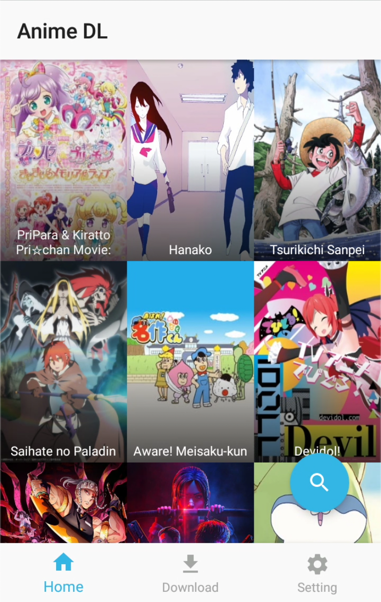

 
# Anime DL : Android Version
Anime Dl now with 7 sources to choose from.
#### Latest Version 4.3 build 0001
A simple app let you watch and bulk download anime with faster anime Browsing, Streaming and Downloading.
Steaming and Downloading animes becomes easy.

## New Features and changes in v4.3 build 0001
* Added Spanish subtitle source.

## New Features and changes in v4.2 build 0001
* Fixed all sources 
* Beta version support added for Android TV

## New Features and changes in v4.1 build 0002
* Fixed Error while clicking download All button.

## New Features and changes in v4.1 build 0001
* Replaced Source 3 with new one.
* All sources Refreshed.
* Bug Fixed.

## New Features and changes in v4.0 build 0001
* UI refreshed.
* New Sources added.
* Bug Fixed.

## New Features and changes in v3.0 build 0001
* UI refreshed.
* Dark mode support added.
* All old sources updated and new added.
* Source 3 only support streaming for now.

## New Features and changes in v2.1
* Source 2 and source 4 some error fixes.
* Fixed non-showing of full name in case of long anime names.
* Download all button error fixed in source 4.

## New Features and Changes in v2.0
* Source 4 updated with new links size having ~70mb - ~150mb and resolution mostly 480p or 720p.
* Added External player support, you can set as default or select at the time of playing episode.
* Added pulldown to refresh home function.
* Information section added for basic info regarding sources.
* You can now change the download folder location.
* Save setting popup added for user info.
* Click to directly start the video from download menu for whose which are completed.(It goes with the default setting means internal or external whichever is set in settings, no confirmation dialog).
* Fixed Android 7 crashing

## Feature and Fixes
* Android supporting version
* Auto check for update
* Inbuilt video player for streaming
* Multiple sources to download from. More sources on the way.
* Stream or Download all or multiple episode with single clicks from a single window.
* Easy to use and navigate
* Integrated download manager for fast downloading.
* Queue support. #Download parallelly 2 episodes.
* New Source added in place of source 3, Best highspeed 1080p videos stream and download.
* Faster anime searching and loading.
* Source 2 fixed streaming and downloading. Now having both subbed and dubbed anime with highspeed links.
* Bug fix: download error not showing
* and many more

### Some Button Means:
#### "Switch to Stream mode"
* Switch to Stream mode Disable = Download Mode, starts the download.
* Switch to Stream mode Disable = Stream Mode, Play the video with player of your choose.
#### "Switch to Dub mode"
* Switch to Dub mode enable = Subbed anime mode, Download or streams the animes with subs.
* Switch to Dub mode disable= Dubbed anime mode, In case the dubbed version of the anime released the download or stream will start else shows error with no link available.
#### "Download all"
* Download all = Batch anime episode download

### Note:-
* If you have any suggestion or new feature idea feel free to contact me.
* I want make this app to reach as many as people as possible please help me with that as i don't know any other platform to share this app.
* For any issue feel free to email me.(Email in setting of application)
* M3U8 downloading not supported, However you can stream the anime.

Download Link:- Please see the released section. 
Alternative Download Links:- http://a.animedlweb.ga/

PC version Link:- http://a.animedlweb.ga/

(Note:- If you facing any issue during installation, uninstall old version and try again).

Discord Server Link:- https://discord.gg/Ee3fegN

#### Requirements:
    * Internet
    * Android 5 or higher installed.
   
	
Install the application downloaded APK and start the app from your launcher.

